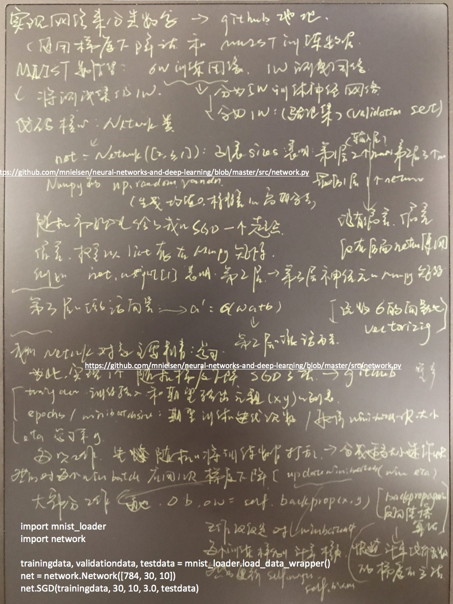
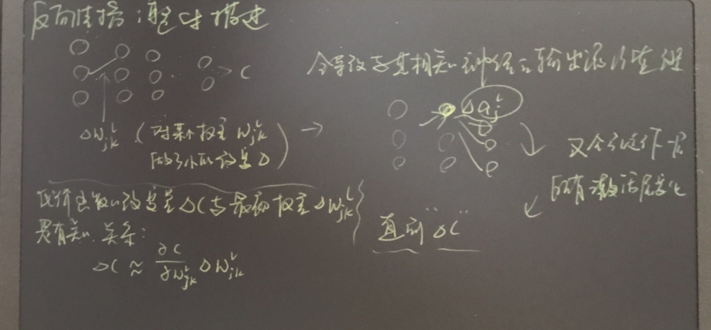
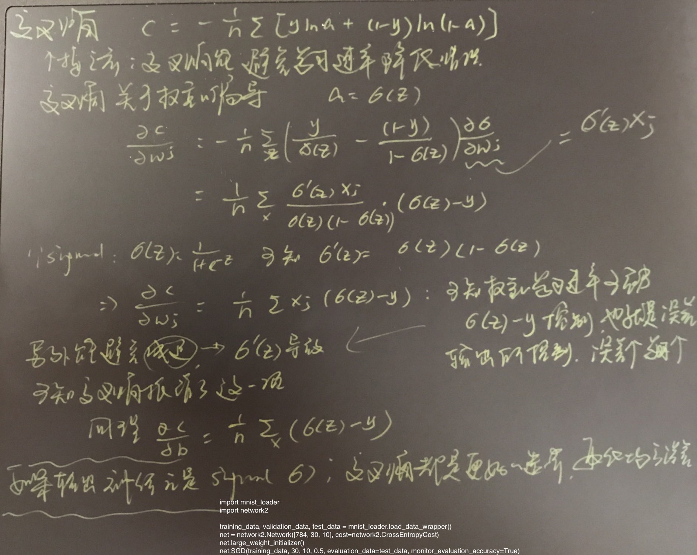
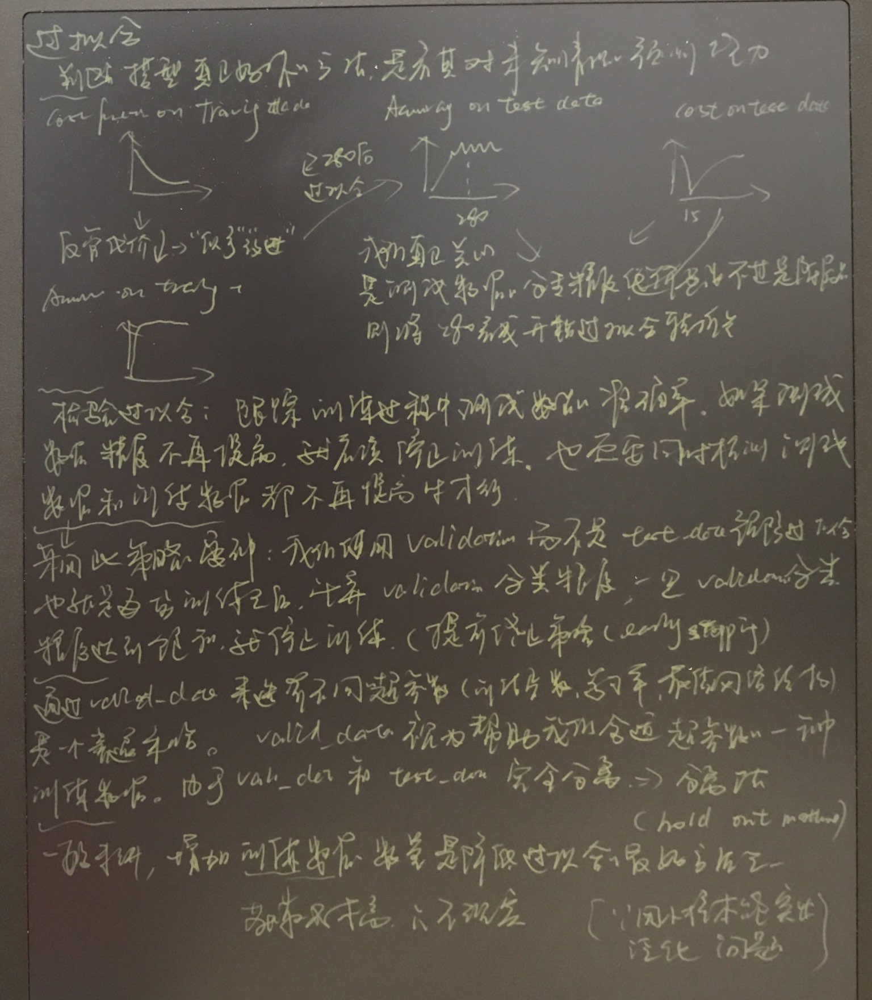
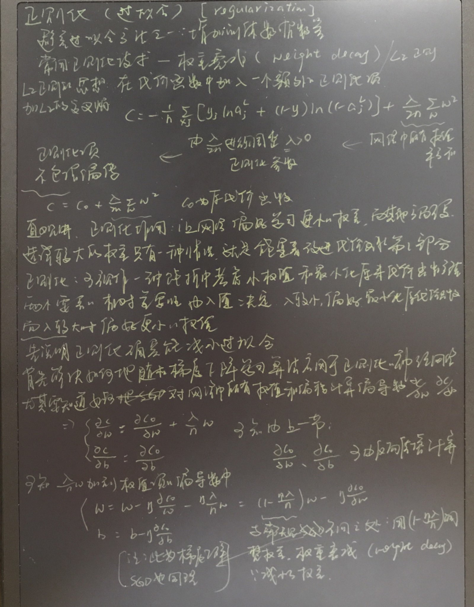
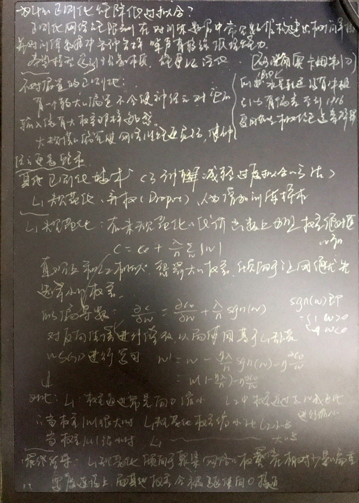
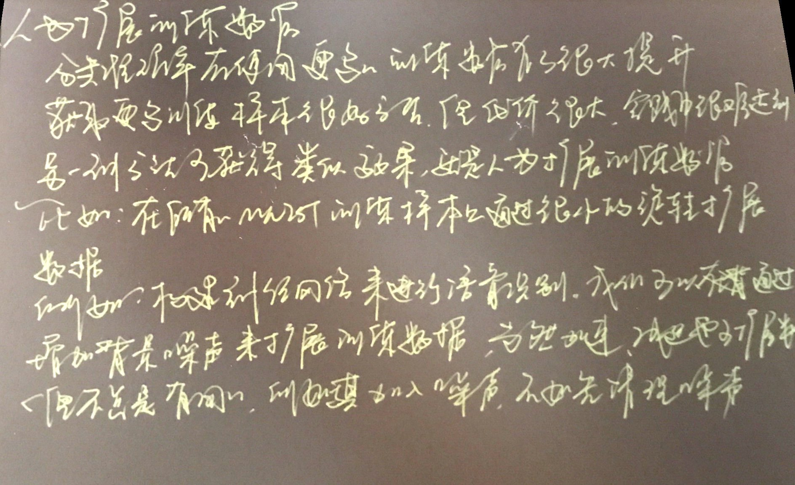
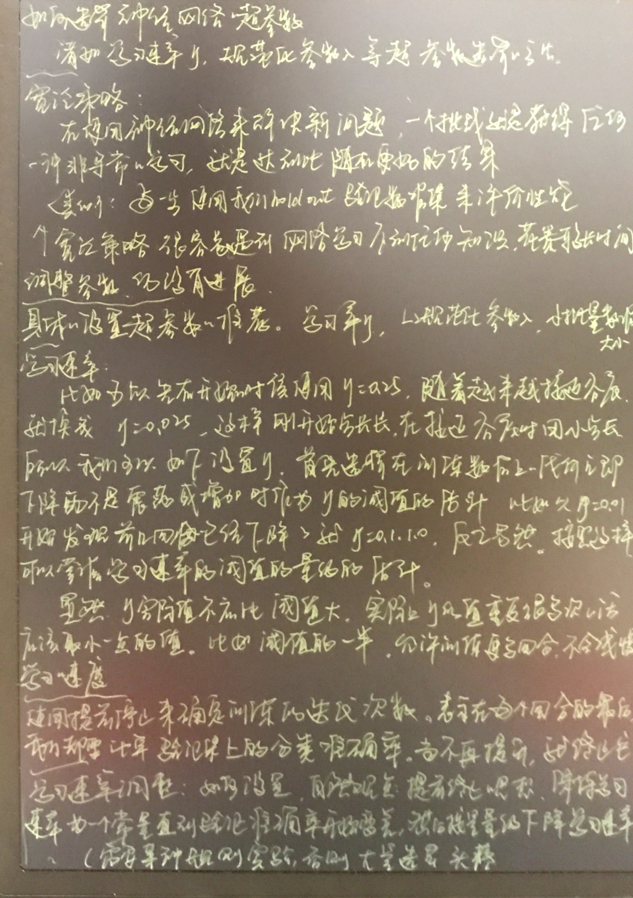
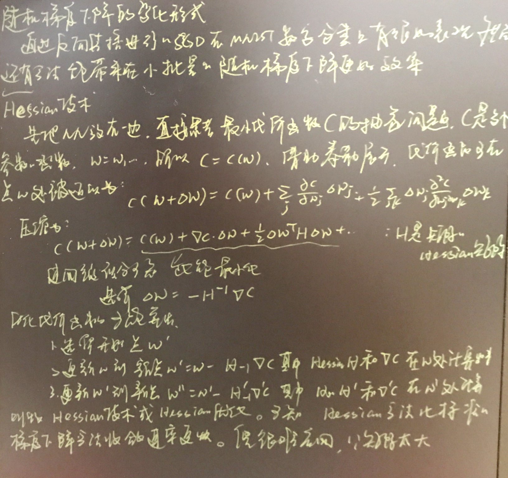
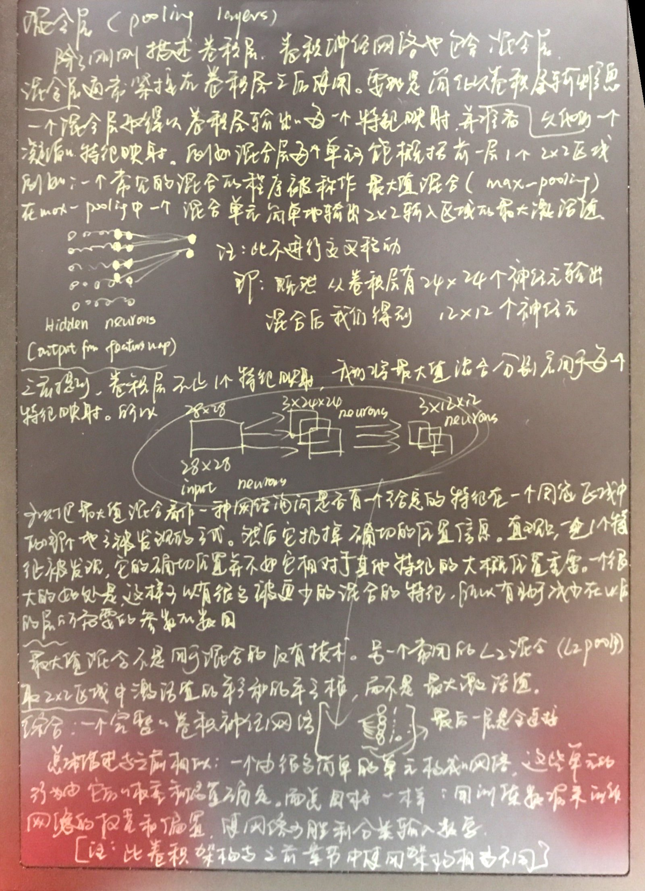

注：为个人学习总结需要，如有侵权，请您指出。[持续更新， 如有错误，请您指出]        

> 邮箱：*<u>yangqiokay@foxmai.com</u>*      微信号：<u>*18810578662*</u>

​    

## **「Fight！秋招」**

------

### A.关于「Fight！秋招」「技能&专业书」：1／num

### **[1.《神经网络与深度学习》连载翻译](http://chuansong.me/n/1895437651113)**

| 三次总结&忌盲目乐观    | 二次总结&能讲出来                                | 背诵条目&一次总结                                | 参考理解                                     |
| ------------- | ---------------------------------------- | ---------------------------------------- | ---------------------------------------- |
| 开始NN的学习规则算法一套 | 1.NN思路是利用训练学规则。2.基础是感知机的输入加权阈值决策         | [1感知机、](https://github.com/GeekQi/SkillGetDaily/blob/master/Skill%26Note/1%E6%84%9F%E7%9F%A5%E6%9C%BA.jpeg) 1..神经网路使用思路：利用训练数据学习规则 2.感知机：神经元一种，多个输入的加权和，并与阈值比较，实现决策；复杂网络的感知机能做出更精准决策。 |            |
|               | 1.既然NN学习规则，感知机网络需要学习w/b来实现决策。2.可知w/b的学习需要微调，Sigmoid平滑感知机符合 | [2Sigmoid神经元与学习算法与感知机比较、](https://github.com/GeekQi/SkillGetDaily/blob/master/Skill%26Note/2Sigmoid%E7%A5%9E%E7%BB%8F%E5%85%83%E4%B8%8E%E5%AD%A6%E4%B9%A0%E7%AE%97%E6%B3%95%E4%B8%8E%E6%84%9F%E7%9F%A5%E6%9C%BA%E6%AF%94%E8%BE%83.jpeg) 1.学习算法：感知机的网络需要学习w\b来正确分类任务；2.学习算法需要w\b的微调带来输出的微调，感知机不满足 3.sigmoid函数：平滑感知机 |  |
|               | 1.NN的网络需要知道基本结构：输入／隐藏／输出。2.决策判定          | [3神经网络结构及简单网络结构解决手写识别、](https://github.com/GeekQi/SkillGetDaily/blob/master/Skill%26Note/3%E7%A5%9E%E7%BB%8F%E7%BD%91%E7%BB%9C%E7%BB%93%E6%9E%84%E5%8F%8A%E7%AE%80%E5%8D%95%E7%BD%91%E7%BB%9C%E7%BB%93%E6%9E%84%E8%A7%A3%E5%86%B3%E6%89%8B%E5%86%99%E8%AF%86%E5%88%AB.jpeg) 1.NN结构：输入／隐藏／输出，又叫多层感知机。2.简单手写：比如3层NN，输入28*28的784个n,15个h,10个output，哪个S最高，决策为哪个。 3。隐藏层：判断比如0的左上边是否存在。 |  |
|               | 1.既然学习w/b来做决策，决策的好坏需要定义，用C最小化 2.最小化的方法：梯度下降 | [4梯度下降学习参数1、](https://github.com/GeekQi/SkillGetDaily/blob/master/Skill%26Note/4%E6%A2%AF%E5%BA%A6%E4%B8%8B%E9%99%8D%E5%AD%A6%E4%B9%A0%E5%8F%82%E6%95%B01.jpeg) 1.最小化问题：输入X,输出y，算法需要学习合适w/b让y与目标近似，近似达标用C定义。最小化问题用梯度下降。 2.梯度下降&C要最小化：C的变化要为负数，也就是沿着C的梯度的反方向。 |  |
|               | 1.提到了梯度下降就得说下SGD来加快训练                    | [5梯度下降2&SGD&OnlineLearning、](https://github.com/GeekQi/SkillGetDaily/blob/master/Skill%26Note/5%E6%A2%AF%E5%BA%A6%E4%B8%8B%E9%99%8D2%26SGD%26OnlineLearning.jpeg) 1.怎么找w/b:C的变化是负的，w/b变化也是负，需要每个训练样本求C的梯度得到w/b  2.SGD：每个都求太慢，每次少用点样本训练，求C的梯度，更新w/b。3.online-learning：mini-batch的极端：=1，每次一个训练数据。 |  |
|               | 1.这下就可以用SGD和MNIST分类了                     | [6实现网络来分类数字、](https://github.com/GeekQi/SkillGetDaily/blob/master/Skill%26Note/6%E5%AE%9E%E7%8E%B0%E7%BD%91%E7%BB%9C%E6%9D%A5%E5%88%86%E7%B1%BB%E6%95%B0%E5%AD%97.jpeg) 1.用SGD和MNIST：a.训练数据打乱&选择合适mini。b.梯度下降w／b（主要反向传播） |  |
|               |                                          | 源代码理解：                                   |                                          |
|               | 1.DL的基本过程是复杂的分解                          | [7迈向深度学习、](https://github.com/GeekQi/SkillGetDaily/blob/master/Skill%26Note/7%E8%BF%88%E5%90%91%E6%B7%B1%E5%BA%A6%E5%AD%A6%E4%B9%A0.jpeg) 1.DL过程：将复杂问题分解成子问题，最后单像素可回答的简单问题，有多层复杂的层级结构，比单层更出色 |      |
|               | 1.代数表示的矩阵形式 2.SGD中一个核心：反向传播              | [8基于矩阵的NN输出&反向传播损失函数、](https://github.com/GeekQi/SkillGetDaily/blob/master/Skill%26Note/8%E5%9F%BA%E4%BA%8E%E7%9F%A9%E9%98%B5%E7%9A%84NN%E8%BE%93%E5%87%BA%26%E5%8F%8D%E5%90%91%E4%BC%A0%E6%92%AD%E6%8D%9F%E5%A4%B1%E5%87%BD%E6%95%B0.jpeg) 1.矩阵表示：激活值al为al-1加权输入的s函数 2.反向传播2点：a.代价C是每个独立样本代价的平均 b.代价C可写成激活输出的函数C = C(a) |  |
|               | 1.反向传播是啥来着：4个等式                          | [9反向传播4基本等式](https://github.com/GeekQi/SkillGetDaily/blob/master/Skill%26Note/9%E5%8F%8D%E5%90%91%E4%BC%A0%E6%92%AD4%E5%9F%BA%E6%9C%AC%E7%AD%89%E5%BC%8F.jpeg) 1.w/b怎么改变C：归结到计算C的梯度，且定义了错误量=C对Z的偏导。2.四个等式是啥：a.输出层错误量=C对a的偏导（激活输出的代价变化快慢)XZ处激活函数S的变化快慢。b.l层错误量由l+1层错误量获得。c.C对b的偏导=错误量 d.C对w的偏导=激活值X错误量 |  |
|               | 1.反向传播知道了&SGD一起来求梯度，然后得到学习的w/b           | [10反向传播算法&SGD&优点](https://github.com/GeekQi/SkillGetDaily/blob/master/Skill%26Note/10%E5%8F%8D%E5%90%91%E4%BC%A0%E6%92%AD%E7%AE%97%E6%B3%95%26SGD%26%E4%BC%98%E7%82%B9.jpeg) 1.计算代价函数的梯度算法：a.输入x得到激活函数值a。b.正向计算加权和z&a=S(z) c.计算输出误差 =4等式的a d.误差反向传播=4等式的b e.输出C的梯度=4等式的c&d.      2. SGD与反向传播结合：a.输入训练样本 b.对每个x设定激活函数值，并执行b.1正向传播计算加权和 b.2输出误差4等式的a。b.3误差反向4等式的b。 c.梯度下降w/b更新 3.反向传播优点：一次前向、反向就同时计算所有偏导。 |  |
|               |                                          | [11反向传播整理描述](https://github.com/GeekQi/SkillGetDaily/blob/master/Skill%26Note/11%E5%8F%8D%E5%90%91%E4%BC%A0%E6%92%AD%E6%95%B4%E7%90%86%E6%8F%8F%E8%BF%B0.jpeg) 1.某个w变了》激活函数值变了》直到C变了。 |  |
| 以上就是一套的学习过程了： |                                          | 从感知机-S-定义C-最小化-梯度下降-SGD-反向传播-学习到w/b      |                                          |
| 以下就是对上边的优化了   |                                          |                                          |                                          |
| 第一种优化：        |                                          | 优化1:选择更好的代价函数：交叉熵代价函数                    |                                          |
|               | 1.变代价函数为交叉熵                              | [12改进学习&交叉熵损失函数](https://github.com/GeekQi/SkillGetDaily/blob/master/Skill%26Note/12%E6%94%B9%E8%BF%9B%E5%AD%A6%E4%B9%A0%26%E4%BA%A4%E5%8F%89%E7%86%B5%E6%8D%9F%E5%A4%B1%E5%87%BD%E6%95%B0.jpeg) 1.择优代价函数：交叉熵代替二次代价函数，满足非负，且最终接近0&能避免学习速率降低。 |  |
|               | 1.交叉熵优势                                  | [13交叉熵解决手写数字识别问题](https://github.com/GeekQi/SkillGetDaily/blob/master/Skill%26Note/13%E4%BA%A4%E5%8F%89%E7%86%B5%E8%A7%A3%E5%86%B3%E6%89%8B%E5%86%99%E6%95%B0%E5%AD%97%E8%AF%86%E5%88%AB%E9%97%AE%E9%A2%98.jpeg) 1.交叉熵为啥避免减速：对w的偏导数去掉了S的导数项 |  |
| 第二种优化：        |                                          | 优化2:与优化1不同，输出层：把S换成softmax&代价函数换成最大似然并应用反向传播 |                                          |
|               | 1.换了S函数。换了代价函数                           | [14Softmax&学习衰减&loglikelihood](https://github.com/GeekQi/SkillGetDaily/blob/master/Skill%26Note/14Softmax%26%E5%AD%A6%E4%B9%A0%E8%A1%B0%E5%87%8F%26loglikelihood.jpeg) 1.与交叉熵不同类的解决学习衰减方法：对加权输出应用softmax函数 2.最大似然代价函数：满足条件，配合softmax使用。并在此应用反向传播 |  |
| 第三种优化：        |                                          | 优化3:与12都不是一个维度：是从模型的角度：防止过拟合             |                                          |
|               | 1.模型好坏判断 2.过拟合含义 3.交叉验证 4.holdout 5 降低过拟合方法一 | [15过拟合&Valid_data增加训练集](https://github.com/GeekQi/SkillGetDaily/blob/master/Skill%26Note/15%E8%BF%87%E6%8B%9F%E5%90%88%26Valid_data%E5%A2%9E%E5%8A%A0%E8%AE%AD%E7%BB%83%E9%9B%86.jpeg) 1.判断模型好坏：未知情况的预测能力 2.过拟合：训练过程中测试数据精度不再提高，同时也需要测试和训练都看 3.交叉验证：使用va_data而不是test预防过拟合，一旦va精度饱和就停止训练。4.hold out method：va和test完全分离的，va可用来选择超参数。5降低过拟合方法：增加训练数据，但是不现实 |  |
|               | 1.降低过拟合方法二：L2权重衰减                        | [16正则化&权重衰减](https://github.com/GeekQi/SkillGetDaily/blob/master/Skill%26Note/16%E6%AD%A3%E5%88%99%E5%8C%96%26%E6%9D%83%E9%87%8D%E8%A1%B0%E5%87%8F.jpeg) 1.正则化(regularization)：L2/权重衰减：L2加到交叉熵的代价函数后面，通过梯度下降／反向传播得到权重的系数变小了。 |  |
|               | 1.降低过拟合方法三：L1正则                          | [17正则化&L1规范化](https://github.com/GeekQi/SkillGetDaily/blob/master/Skill%26Note/17%E6%AD%A3%E5%88%99%E5%8C%96%26L1%E8%A7%84%E8%8C%83%E5%8C%96.jpeg) 1.L1正则：与L2相似，向0缩小。 |  |
|               | 1.降低过拟合方法四：弃权                            | [18正则化&弃权](https://github.com/GeekQi/SkillGetDaily/blob/master/Skill%26Note/18%E6%AD%A3%E5%88%99%E5%8C%96%26%E5%BC%83%E6%9D%83.jpeg) 1.弃权：与L1L2不同，Dropout不修改代价函数，改变网络结构。但是平均效果减轻过拟合 |    |
|               | 1.降低过拟合方法五：人为扩展                          | [19正则化&人为扩展](https://github.com/GeekQi/SkillGetDaily/blob/master/Skill%26Note/19%E6%AD%A3%E5%88%99%E5%8C%96%26%E4%BA%BA%E4%B8%BA%E6%89%A9%E5%B1%95.jpeg) 1.人为扩展：比如图片稍微旋转15度 |  |
| 第四种优化         |                                          | 优化4:与123都不一样：之前是对输出层。现在对隐含层的权重修改。再结合L2正则 |                                          |
|               | 1.解决方法一：初始权重影响速度，需更改                     | [20权重初始化&学习加速](https://github.com/GeekQi/SkillGetDaily/blob/master/Skill%26Note/20%E6%9D%83%E9%87%8D%E5%88%9D%E5%A7%8B%E5%8C%96%26%E5%AD%A6%E4%B9%A0%E5%8A%A0%E9%80%9F.jpeg) 1. 之前加速都是对输出层，现在对隐含层改变初始权重：再结合L2 |  |
|               | 2.解决方法二：宽泛策略。解决方法三：学习速率参数选择              | [21超参数&学习速率&提前停止](https://github.com/GeekQi/SkillGetDaily/blob/master/Skill%26Note/21%E8%B6%85%E5%8F%82%E6%95%B0%26%E5%AD%A6%E4%B9%A0%E9%80%9F%E7%8E%87%26%E6%8F%90%E5%89%8D%E5%81%9C%E6%AD%A2.jpeg) 1.宽泛策略：va来调整，麻烦 2.学习速率：多次尝试选择C下落的预知 |  |
|               | 解决方法四：L2参数选择。解决方法五：自动调整                  | [22规范化(正则)&自动技术](https://github.com/GeekQi/SkillGetDaily/blob/master/Skill%26Note/22%E8%A7%84%E8%8C%83%E5%8C%96(%E6%AD%A3%E5%88%99)%26%E8%87%AA%E5%8A%A8%E6%8A%80%E6%9C%AF.jpeg) 1.正则化参数：先为0设定学习率。然后va选择好的L2参数。 2. 网格搜索：自动化调整参数 | &自动技术.jpeg) |
| 以上便是学习过程的总结了： |                                          | 在原来的基础上：优化1:选择更好的代价函数：交叉熵代价函数。优化2:与优化1不同，输出层：把S换成softmax&代价函数换成最大似然并应用反向传播。优化3:与12都不是一个维度：是从模型的角度：防止过拟合。优化4:与123都不一样：之前是对输出层。现在对隐含层的权重修改。再结合L2正则 |                                          |
|               |                                          | [23随机梯度下降变化&Hessian技术](https://github.com/GeekQi/SkillGetDaily/blob/master/Skill%26Note/23%E9%9A%8F%E6%9C%BA%E6%A2%AF%E5%BA%A6%E4%B8%8B%E9%99%8D%E5%8F%98%E5%8C%96%26Hessian%E6%8A%80%E6%9C%AF.jpeg) 1. |  |
|               | 1.NN的近似及连续                               | [24神经网络计算任何函数](https://github.com/GeekQi/SkillGetDaily/blob/master/Skill%26Note/24%E7%A5%9E%E7%BB%8F%E7%BD%91%E7%BB%9C%E8%AE%A1%E7%AE%97%E4%BB%BB%E4%BD%95%E5%87%BD%E6%95%B0.jpeg) 1. 预先声明：a.是近似 b.连续函数。 |  |
|               | 1.梯度的不稳定性带来的问题                           | [25梯度消失问题](https://github.com/GeekQi/SkillGetDaily/blob/master/Skill%26Note/25%E6%A2%AF%E5%BA%A6%E6%B6%88%E5%A4%B1%E9%97%AE%E9%A2%98.jpeg) 1.vanishing gradient problem：梯度不稳定的，b微调，则a微调，z微调。最终代价函数C变化。得到C对b的偏导师一串S导数乘积。 |    |
| 开始CNN的介绍      | 1.CNN的3概念及特征映射等概念                        | [26卷积神经网络&共享权值偏重](https://github.com/GeekQi/SkillGetDaily/blob/master/Skill%26Note/26%E5%8D%B7%E7%A7%AF%E7%A5%9E%E7%BB%8F%E7%BD%91%E7%BB%9C%26%E5%85%B1%E4%BA%AB%E6%9D%83%E5%80%BC%E5%81%8F%E9%87%8D%26.jpeg) 1.卷积CNN3个概念：a.局部感知野 b.共享权重／偏置(特征映射、卷积核／滤波器)c.混合(max-pooling)。最后一层：全连接。 |  |
|               | 1.CNN的整体思路                               | [27混合层&完整卷积神经网络](https://github.com/GeekQi/SkillGetDaily/blob/master/Skill%26Note/27%E6%B7%B7%E5%90%88%E5%B1%82%26%E5%AE%8C%E6%95%B4%E5%8D%B7%E7%A7%AF%E7%A5%9E%E7%BB%8F%E7%BD%91%E7%BB%9C.jpeg) 1.总体目标：用训练数据学习权重／偏置使得可以完成正确分类任务 |  |
|               | 1.CNN的训练优势                               | [28卷积实际应用&训练.](https://github.com/GeekQi/SkillGetDaily/blob/master/Skill%26Note/28%E5%8D%B7%E7%A7%AF%E5%AE%9E%E9%99%85%E5%BA%94%E7%94%A8%26%E8%AE%AD%E7%BB%83.jpeg) 1.实际：tanh激活函数／修正线性单元 2.训练理由：卷积减少参数、L等正则、修正线性单元加速 |  |
| 开始其他网络        | 1RNN特点 2.LSTM用来解决梯度问题 3.DBN干啥            | [29RNN&LSTM&深度信念网络](https://github.com/GeekQi/SkillGetDaily/blob/master/Skill%26Note/29RNN%26LSTM%26%E6%B7%B1%E5%BA%A6%E4%BF%A1%E5%BF%B5%E7%BD%91%E7%BB%9C.jpeg) 1.RNN：动态变化，时间序列上，语音识别 2.LSTM：梯度不稳定问题反向传播加上时间更复杂，LSTM解决此问题 3.DBN学习生成规则 |  |