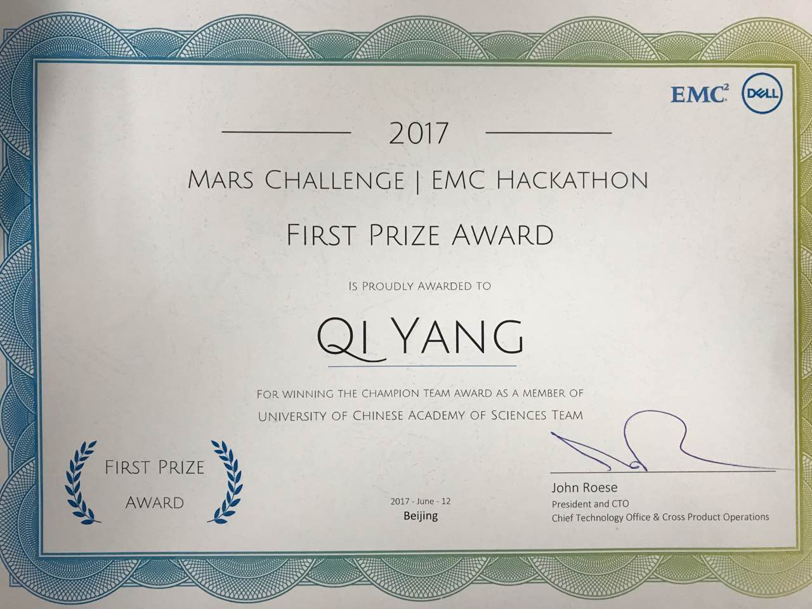

注：为个人学习总结需要，如有侵权，请您指出。[持续更新， 如有错误，请您指出]        

​    

 ##                      **「礼貌的笑了笑，寸步不让」** 

-----

关于「学术论文／研究项目／工程项目／创业项目」：

### 关于「专业书」：

### 关于「练手到熟练项目」：

Java基础：参考：

##### **Web项目:**

- Python 爬虫：参考：[Scrapy](http://wiki.jikexueyuan.com/project/scrapy/)、

- Java Web：参考：[Java Web](http://wiki.jikexueyuan.com/project/java-web/)、
- PHP+MySQL搭建网页：参考：[PHP+MySQL](http://wiki.jikexueyuan.com/project/php-and-mysql-web/) 、

##### **数据挖掘／自然语言处理项目：**

- 建模

##### **算法基础：**

- 数据结构：参考：[剑指Offer](http://wiki.jikexueyuan.com/project/for-offer/) 、[LeetCode](http://wiki.jikexueyuan.com/project/leetcode-book/)
- 算法：参考：

##### **大数据项目：**

- Spark、Scala

### 关于「论文」：1%

数量：

##### [基于关键词及问题主题的问题相似度计算](http://chuansong.me/n/1906250351625) ：

- 社区问答系统、判断问题相似度、推荐问题的答案、避免重复提问。
- 问题包括：问题主题及问题描述
- KT-CNN模型包括：
  - 关键词抽取：
    - 对输入问题S和T,先预处理在通过此模块抽取S和T的关键词序列Ks和Kt
      - **需要：**得分排序序列、TextRank算法、无向有全图、图排序以及选取关键词、TF-IDF
  - 基于关键词相似相异的问题建模:
    - 利用Ks和Kt间相似相异信息，对S和T建模得到特征向量Fs和Ft
      - **需要**：基于文本间相似及相异信息的CNN模型、词向量表示、GloVe模型、语义匹配：相似矩阵、余弦相似度、皮尔森相关系数、矩阵分解、CNN模型卷积层、CNN模型最大池层、
  - 计算主题相似度:
    - 对问题S和T的主题Ts和Tt计算相似度Sim_topic
      - **需要**：向量表示、皮尔森相关系数
  - 问题相似度计算:
    - 基于问题S和T的特征向量Fs和Ft及主题相似度Sim_topic计算S和T的相似度Sim_q
      - **需要**：线性模型的加权相加

##### [人机对话系统中基于关键词的回复生成技术](http://chuansong.me/n/1873214451926)：

- 早期回复生成技术：基于规则：文本分析规则。／／ 序列决策问题：马尔可夫决策
- 回复生成问题：Seq2Seq深度学习框架：用户消息和回复被建模成两个序列，通过大规模训练数据训练模型学习两个序列间的映射关系。
  - 极大似然估计方法的交叉熵损失函数、最大互信息损失、随机变量
- 使用关键词增强生成回复的相关性
  - Seq2BF（sequence to backward and forward sequences）模型
  - 分为两阶段：根据用户消息在词表中选取和消息具有最大互信息的词作为关键词，根据关键词预测回复的剩余部分。
  - 简要介绍：Seq2Seq 框架下基本的回复生成模型：
    - 两部分之encoder：负责将消息编码成一个模型的内部表示
    - 两部分之decoder：在encoder输出条件下，从特定字符开始，逐字生成完整的回复内容。

##### [文本生成概述](http://chuansong.me/n/1851499951313)：

- 根据格式化数据或自然语言文本生成新闻等可解释文本、定义、任务、评价指标、实现方法、数据驱动方法
- 文本生成定义：接受非语言形式的信息作为输入，生成刻度的文字表示。数据到文本的生成。
- 文本生成任务：文本到文本、数据到文本、图像到文本
  - 文本到文本：
    - 文本摘要：
      - 抽取式摘要：信息抽取和规划等主要步骤
        - 主题模型、聚类、SVR(Support Vector Regression)、线性回归、抽取名词短语、动词短语、随机森林、
      - 生成式摘要
- 文本生成方法：基于规则、基于规划、数据驱动
  - 基于语言模型的自然语言生成：n-gram
  - 使用深度学习的自然语言生成

##### [事件演化的规律和模型](http://chuansong.me/n/1835019551922)：

- 事件图谱、图结构、马尔可夫逻辑网络（无向图）、贝叶斯网络（有向五环图）。事理图谱（有向有环图）。
- 事理图谱的定义：
  - 事件：用抽象、泛化的谓词短语来表示。：不关注时间、地点等
  - 事件间顺承关系：两个时间在时间上先后发生的关系。
  - 事件因果关系：满足顺承关系时序约束的基础上，两个事件件有很强的因果性，强调前因后果。
  - 事理图谱**Event Evolutionary Graph** ：描述事件之间顺承、因果关系的事理烟花逻辑有向图。以某个事件节点进行广度优先搜索，扩展得到事件演化链条。
    - 事理图谱是一种概率有向图。概率图模型的贝叶斯网络、马尔可夫逻辑网络、贝叶斯用有向无环图表达变量节点间的条件依赖与独立性关系。马尔可夫随机场采用无向图表达变量间的相互作用关系。

##### [阿里自然语言处理部总监：NLP技术的应用及思考](http://chuansong.me/n/1810576651425) ：

郎君博士，哈工大社会计算与信息检索研究中心博士毕业生，目前为阿里巴巴iDST自然语言处理部总监

- 计算平台、业务层、NLP4大经典AI完全难题：问答、复述、文摘、翻译。
- 阿里需要：技术体系及服务、核心业务快速增长、商业机会
  - 内容搜索、内容推荐、评价、问答、文摘、文本理解
  - 商品搜索、推荐、智能交互、翻译、广告、风控、舆情监控、
- 词法分析：分词、词性、实体：
  - Bi-LSTM-CRF、多领域词表
  - 推荐算法、蚂蚁金服、资讯搜索
- 句法分析：依存句法分析、成分句法分析：
  - Shift-reduce、graph-based、Bi-lSTM
  - 资讯搜索、评价情感分析、商品标题、搜索Query
- 情感分析：情感对象、属性、属性关联
  - 情感辞典挖掘、属性级、句子级、篇章级情感分析
  - 商品评价、问答、品牌舆情、互联网舆情
- 句子生成：句子可控改写、句子压缩
  - Beam Search、 Seq2Seq+Attention
  - 商品标题压缩、资讯标题改写、PUSH消息改写
- 句子相似度：浅层相似度、语义相似度
  - Edit Distance、Word2Vec、DSSM
  - 相似问题、商品重发检测
- 文本分类／聚类：垃圾防控、信息聚合
  - ME, SVM, FastText
  - 商品类目预测、问答意图分析、文本垃圾过滤、舆情聚类、名片OCR后语义识别
- 文本表示：词向量、句子向量、篇章向量、Seq2Seq
  - Word2Vec、LSTM、DSSM、Seq2Seq
- 知识库：电商同义词／上下位、通用同义词／上下位。领域词库、情感词库
  - bootstrapping、click-through mining、word2vec、k-means、CRF
  - 语义归一、语义扩展、Query理解、意图理解、情感分析
- 语料库：分词、词性标注数据、依存句法标注数据
- 标题分析：分词、实体打标、热度计算、中心识别
- 评价系统：treelink模型、maxent模型、贝叶斯模型、dbn模型总体融合
- 决策购买问题：产品化：分为四类：
  - 无效问题过滤：
    - 分类采用LR+GBDT：定制特征
  - 相似问题识别：
    - Doc2Vec 计算相似度、人工评测
  - 页面问答排序
    - 内容丰富度、点赞数、过滤词表匹配数等加权求和、CTR提升
  - 智能分发

##### [基于深度多任务学习的自然语言处理技术](http://chuansong.me/n/1768183851425) 

- 统计自然语言处理依赖标注数据
- 多任务学习Multi-task Learning：
  - 有监督学习Supervised Learning， 利用人工标注的训练数据进行学习
  - 归纳迁移机制，基本目标是提高泛化性能。利用并行训练的方法学习多个任务。 多任务学习的基本假设是多个任务之间具有相关性。
  - 词法、句法、语义分析等多任务，之间存在紧密的内在联系
- 深度多任务学习：
  - 深度学习：建立在含有多层非线性变换的神经网络结构之上，对数据进行抽象表示和学习的一系列机器学习算法。

##### [对话系统的Goal Oriented和Task Oriented 概念的异同](http://chuansong.me/n/1758705951350)

- 人机对话系统：
  - 开放域对话系统：闲聊：微软小冰。 百度问答：度秘。
  - 任务型对话系统：设备控制：Siri。公交线路查询、餐厅预订。

##### [自然语言处理中的知识获取](http://chuansong.me/n/1724644951614)

- 各个行业：教育、医疗、法律等知识服务型行业
- 自然语言中任何问题抽象为：如何从形式与意义的多对多映射中，根据语境选择一种正确的映射。
- 自然语言处理中知识获取的三要素：
  - 显性知识：
    - 元知识，如WordNet、知识图谱
  - 数据：
    - 带标注数据、无标注
  - 学习算法：
    - SVM、CRF等浅层学习模型，人工定义的特征模版抽取特征及特征组合，结合
    - RNN、CNN等深度学习模型，自动学习有效特征及特征组合的能力
- 大数据和深度学习相互依赖的：
  - 一方面大数据需要复杂的学习模型。长尾数据、复杂模型、大数据
  - 另一方面深度学习需要大数据。神经网络机器翻译（NMT）已经迅速超越统计机器翻译（SMT）、端到端
    - 信息抽取两种做法：
      - 1先做句法分析，再做信息抽取
      - 2直接信息抽取，也就是“端到端”，也是分层的

##### [迁移学习：基本概念到相关研究](http://chuansong.me/n/1716697451319)

- 什么是迁移学习：

  - 机器学习的监督学习场景中，如果针对任务和域A训练一个模型，我们假设被提供了此标签数据。
  - 迁移学习借用已存在的相关任务或域的标签数据来处理场景。尝试把源域中解决源任务时获得的知识存储下来，应用到目标域的目标任务中。

- 为什么需要迁移学习：

  - Andrew Ng：迁移学习将会是继监督学习之后的下一个机器学习商业成功驱动力。
  - ml在产业界的应用和成功主要：监督学习的驱动。
  - 无监督学习是实现通用人工智能的关键成分。
  - 产业界对ml的应用分2类：
    - 一方面：先进模型
    - 另一方面：大量标签数据使得模型成功
  - 迁移学习可以帮助我们处理全新的场景，是ml在没有大量标签任务和域中规模化应用所必须的。

- 迁移学习定义

  - 给定一个源域 Ds，一个对应的源任务 Ts，还有目标域 Dt，以及目标任务 Tt，现在，迁移学习的目的就是：在 Ds≠Dt，Ts≠Tt 的情况下，让我们在具备来源于 Ds 和 Ts 的信息时，学习得到目标域 Dt 中的条件概率分布 P（Yt|Xt）

- 迁移学习场景

  - 给定源域和目标域 Ds 和 Dt，其中，D={X,P(X)}，并且给定源任务和目标任务 Ts 和 Tt，其中 T={Y,P(Y|X)}。源和目标的情况可以以四种方式变化

- 迁移学习的应用

  - 从模拟中学习：google自动驾驶、机器人等

- 迁移学习方法

  - 使用预训练CNN特征
  - 理解卷积神经网络、全连接层

##### [如何让人工智能学会用数据说话](http://chuansong.me/n/1668814251914)

- 基于结构化数据的的文本生成
  - 机器翻译、文本摘要、诗词生成等都属于文本生成的范畴：
    - 共同点：用户输入非结构化文本，机器根据目标输出相应文本
- 结构化文本生成：特点：基于数据和事实
- 文本生成的典型商业应用：财经、体育类新闻报道的生成、产品描述、商业数据的分析和解释、物联网数据的分析。比如：天气预报自动生成。
- 文本生成的技术发展：
  - 对选定的数据记录，用自然语言描述出来
- 方法：
  - 早期：基于规则：三个独立的模块：
    - 内容规划(Content planning), 即选择描述那些数据记录或数据域
    - 句子规划(Sentence planning), 即决定所选择的数据记录或数据域在句子中的顺序
    - 句子实现(Surface realization), 即基于句子规划生成实际的文本。
  - 基于神经网络的方法：
    - 基于神经语言模型(Neural Language Model)
    - 基于神经机器翻译(Neural Machine Translation)
    - Semantic Controlled LSTM（Long Short-term Memory）模型:用于文本生成：在LSTM基础上引入了控制门读取结构化数据信息。
- 数据：
  - 天气预报、维基百科人物传记、基于对话的人机对话数据集

##### [卷积神经网络在句子分类上的应用](http://chuansong.me/n/1723633)

- 基于预先训练的词向量而训练的卷积神经网络(CNN-Convolutional Neural Networks)、文本分类、语义分析、词向量word vectors 
- 卷积神经网络CNN利用一个卷积层进行特征提取，最初CV，后来在nlp也得到应用，如语义分析、搜索短语检索、句子分类
- 特征向量使用max-over-time池化、word2vec词向量、

##### [自然语言中的Attention Model](http://chuansong.me/n/2215468)

- 先说Encoder-Decoder框架
  - AM模型基本附着在Encoder-Decoder框架下的。但本身并不依赖于Encoder-Decoder模型：适合处理由一个句子生成另一个句子的通用处理模型。
  - 具体使用什么模型自己定：CNN/RNN/BiRNN/GRU/LSTM/Deep LSTM
- AM：以上的还没有体现出“注意力模型”。

##### [深度学习：推动NLP领域发展的新引擎](http://chuansong.me/n/2793709)

- Word Embedding: word2vec能把词变成向量：忽略词之间的关系(句法关系)、词的顺序等
  - 引入词的关系：Dependency Parser：把抽取出来的Relation作为词的Context
  - 改进Bag of Words:
  - 外部资源和知识库：word2vec只用了词的上下文共现， 没有用外部资源如词典知识库
- RNN／LSTM／CNN
  - RNN相关的模型如LSTM基本上算法是解决结构化问题的标准。比普通的FeesForward Network, RNN 有记忆能力
  - 普通的神经网络只会在学习的时候“记忆”，也就是反向传播算法学习参数。然后不“记忆”了。训练好之后，不管什么时候来一个相同的输入，输出一样。对于image classification没问题，但是speech recognition等nlptask，数据有时序或者结构的。
  - RNN具有“记忆”能力。前一个输出会影响后面的判断。比如：前一个He,后面出现is的概率比are高很多。
  - 最简单RNN直接把前一个时间点的输出作为当前出入的一部分，有梯度消失的问题。比较流行的改进如LSTM和GRU等模型通过gate开关，判断是否需要遗忘／记忆之前的状态，以及当前状态是否需要输出到下个时间点。比如语言模型。
  - CNN最早图像。通过卷积发现位置无关的feature，而且这些feature的参数相同，
    - machine translation、语义角色标注Sematic Role labeling
- Multi-model deep learning
- Reasoning, Attention and Memory
  - RNN/LSTM是模拟人类大脑的记忆机制，但除了记忆之外，Attention也是非常有用的机制

##### [深度学习浪潮中的自然语言处理技术](http://chuansong.me/n/472336251048)

- 目前，机器学习技术为自然语言的歧义、动态性等提供了可行的解决方案，成为研究主流，称为统计自然语言处理。
- 一个统计自然语言处理系统通常由2部分构成：
  - 训练数据（样本）
  - 统计模型（算法）
- 但是传统的机器学习方法在数据获取和模型构建等方面存在严重问题：
  - 大规模标注数据难以获得，带来了严重的数据稀疏问题。
  - 需要人工设计模型所需的特征及特征组合。需要深刻理解和丰富经验
- 基于深度学习的自然语言处理
  - 建立在含有多层非线性变换的神将网络结构之上，对数据的表示进行抽象和学习的一系列机器学习算法。
  - 深度学习为自然语言处理的研究主要带来两方面变化：
    - 一方面使用统一的分布式(低维、稠密、连续)向量表示不同粒度的语言单元，如词、短语、篇章
    - 一方面使用循环、卷积、递归等神经网络模型对不同的语言单元向量进行组合，获得更大语言单元的表示
  - 分布式表示：
    - 深度学习最早在nlp的应用是神将网络语言模型：基本假设低维、稠密、连续的向量表示词汇，又称为分布式词表示(Distributed Word Representation)或词嵌入(Word Embedding)。 可以将相似的词汇表示为相似的向量。
    - 理论上，将原有高维、稀疏、离散的词汇表示方法（One-hot表示）映射为分布式表示是一种降维方法，可有效克服机器学习的维度灾难（Curse of Dimensionality）问题，从而获得更好的学习效果。
  - 语义组合(Semantic Composition)
    - 分布式词表示的思想可以进一步扩展，可通过组合（Composition）的方式来表示短语、句子甚至是篇章等更大粒度的语言单元。
    - 三种神经网络结构实现不同的组合方式
      - 循环神经网络（顺序组合）RNN，Recurrent Neural Network
        - 从左至右顺序的对句子中的单元进行两两组合：“我”和“喜欢”组合，生成隐层h1。将h1和“红”组合，生成h2.类推。传统的RNN存在严重梯度消失（Vanishing Gradient）或者梯度爆炸（Exploding Gradient）问题。
        - 深度学习中一些常用的技术，如使用ReLU激活函数、正则化以及恰当的初始化权重参数等都可以部分解决这一问题
        - 另一类更好的解决方案是减小网络的层数，以LSTM和GRU等为代表的带门循环神经网络（Gated RNN）都是这种思路，即通过对网络中门的控制，来强调或忘记某些输入，从而缩短了其前序输入到输出的网络层数，从而减小了由于层数较多而引起的梯度消失或者爆炸问题
      - 卷积神经网络（局部组合）CNN，Convolutional Neural Network
        - 隐含层神经元只与部分输入层神经元连接，同时不同隐含层神经元的局部连接权值共享。如评论文本分类，最终褒贬性由局部短语决定，且与顺序无关。
        - 由于存在局部接收域性质，各个隐含神经元的计算可以并行的进行，这就可以充分利用现代的硬件设备（如GPU），加速卷积神经网络的计算，这一点在循环神经网络中是较难实现的
      - 递归神经网络（句法结构组合）RecNN，Recursive Neural Network
        - 首先对句子进行语法分析，将结构转化为树状结构，构建深度神经网络。
  - 很多自然语言任务如对话生成，有赖于更大的上下文或语境，传统的基于人工定义特征的方式很难对其进行建模，深度学习模型则提供了一种对语境进行建模的有效方式 
  - 无论何种神经网络模型，都是基于固定的网络结构进行组合，传统的有监督学习框架很难实现该目标，而强化学习（Reinforcement Learning）框架为我们提供了一种自动学习动态网络结构的途径。

[基于深度学习的关系抽取](http://chuansong.me/n/831970551568)

- 信息抽取旨在从大规模非结构或半结构的自然语言文本中抽取结构化信息。关系抽取是其中的重要子任务之一，主要目的是从文本中识别实体并抽取实体之间的语义关系。
- 现有主流的关系抽取技术分为有监督的学习方法、半监督的学习方法和无监督的学习方法三种
  - 有监督的学习方法将关系抽取任务当做分类问题，根据训练数据设计有效的特征，从而学习各种分类模型，然后使用训练好的分类器预测关系。该方法的问题在于需要大量的人工标注训练语料，而语料标注工作通常非常耗时耗力
  - ​

### 关于「当前系统项目」：**40%**

**1.目标明确**

：任务要明确，稍微改一点点，就是另一个目标了。参考自：[王露平博士](http://see.xidian.edu.cn/html/news/7897.html)

**1.1数据获取**

1.1.1工作：**理解**甲方提供Excel版：数据字典／样本数据：(订单明细、POP信息、POP商家评分、商品评论、商品基础信息等19张表格)，并**存储到mysql数据库中**：「数据导入」「数据库建表」等

1.1.2工具：[Linux基础 - get!](http://www.runoob.com/linux/linux-tutorial.html) 、 [sql基础 - get!](http://www.runoob.com/sql/sql-tutorial.html) 、   [mysql基础 - get!](http://www.runoob.com/mysql/mysql-tutorial.html)  

1.1.3参考：

1.2**数据初步分析**

1.2.1工作：原始19张表的数据分布初步探索「数据均值等分布」

1.2.2工具：[python基础 -- get！](http://www.runoob.com/python/python-tutorial.html) 、pandas

1.2.3参考：

**2.业务理解数据**

2.1**特征维度选择**

2.1.1工作：从原始19张表中结合业务理解，选择特征维度及特征列表

2.1.2工具：Hive。

2.1.3参考：

2.2**特征维度融合**

2.2.1工作：特征列表汇总到**核心目标**业务上的特征维度

2.2.2工具：Hive。

2.2.3参考：

**3.图谱构建**

3.1**图谱构建**

3.1.1工作：依据特征维度，构建图谱

3.1.2工具：Hive

3.1.3参考：

3.2图谱分析

3.2.1工作：基于图谱，提取特征

3.2.2工具：[python基础 -- get！](http://www.runoob.com/python/python-tutorial.html)、NetworkX

3.2.3参考：

**4.单模型特征应用**

4.1**回归模型选择**

4.1.1工作：单模型对提取出的特征进行评估

4.1.2工具：scikit-learn、XGB。

4.1.3参考：

4.2附：文本相似度分析过程：

4.2.1工作：匹配SELF与POP的名称

4.2.2工具：gensim、[python基础 -- get！](http://www.runoob.com/python/python-tutorial.html) 

4.2.3参考：

**5.多层级模型特征应用**

5.1**架构搭建**

5.1.1工作：多模型的架构搭建

5.1.2工具：

5.1.3参考：

-----

### 关于「基础技能」：

> 服务端：

[python基础 - get！](http://www.runoob.com/python/python-tutorial.html) 字符串、列表、字典、元组、IO、异常、多线程、面向对象、正则、MySQL、JSON、100实例

[Java基础 - get!](http://www.runoob.com/java/java-tutorial.html)    Java例子

[Linux基础 - get!](http://www.runoob.com/linux/linux-tutorial.html) 登陆、用户、文件、Vim

[Docker基础 - get!](http://www.runoob.com/docker/docker-tutorial.html)  容器引擎、虚拟化、打包镜像部署、沙盒、虚拟化

[PHP基础 - get！](http://www.runoob.com/php/php-tutorial.html)mysql、XML、AJAX

[正则表达式基础 - get!](http://www.runoob.com/regexp/regexp-tutorial.html)  

[JSP基础 - get!](http://www.runoob.com/jsp/jsp-tutorial.html)  

[Scala基础 - get!](http://www.runoob.com/scala/scala-tutorial.html)  

[设计模式基础 - get!](http://www.runoob.com/design-pattern/design-pattern-tutorial.html)

[Django基础 - get!](http://www.runoob.com/django/django-tutorial.html)  

[Servlet基础 - get!](http://www.runoob.com/servlet/servlet-tutorial.html)  

> 数据库：

[sql基础 - get!](http://www.runoob.com/sql/sql-tutorial.html) 查询、筛选、插入、更新、连接、合并、约束、删除、更改、函数

[mysql基础 - get!](http://www.runoob.com/mysql/mysql-tutorial.html) 匹配、索引、临时表、正则、去重、SQL注入

[MongoDB - get!](http://www.runoob.com/mongodb/mongodb-tutorial.html)  分布式文件存储

[Redis - get！](http://www.runoob.com/redis/redis-tutorial.html)  key-value存储系统

> 开发工具：

[git基础 - get!](http://www.runoob.com/git/git-tutorial.html)  分布式版本控制系统、克隆、修改、提交、工作区、版本库、分支、主线、合并、提交历史、标签、[github](http://www.runoob.com/w3cnote/git-guide.html)

> XML教程：

[XML基础 - get!](http://www.runoob.com/xml/xml-tutorial.html)  可扩展标记语言（e**X**tensible **M**arkup **L**anguage）、传输和存储数据

> Web Service:

[RSS基础 - get!](http://www.runoob.com/rss/rss-tutorial.html)    Really Simple Syndication（真正简易联合）

[RDF基础 - get!](http://www.runoob.com/rdf/rdf-intro.html)   RDF 是一个用于描述 Web 上的资源的框架

> HTML / CSS / JavaScript

[HTML基础 - get!](http://www.runoob.com/html/html-tutorial.html)

[CSS基础 - get!](http://www.runoob.com/css3/css3-tutorial.html)

[Boostrap基础 - get!](http://www.runoob.com/bootstrap/bootstrap-tutorial.html)

[JavaScript基础 - get!](http://www.runoob.com/js/js-tutorial.html)  

[jQuery基础 - get!](http://www.runoob.com/jquery/jquery-tutorial.html)

[AJAX基础 - get!](http://www.runoob.com/ajax/ajax-tutorial.html)  

[JSON基础 - get!](http://www.runoob.com/json/json-tutorial.html) 

[Highcharts基础 - get!](http://www.runoob.com/highcharts/highcharts-tutorial.html)  

> 网站建设：

[HTTP基础 - get!](http://www.runoob.com/http/http-tutorial.html)  HyperText Transfer Protocol、超文本传输协议、TCP/IP传输控制协议/因特网互联协议、客户端-服务端架构、C/S、通讯流程、消息结构、客户端请求消息、服务器响应消息、请求方法、HTTP状态码

[TCP/IP基础 - get!](TCP/IP基础 - get!)   TCP/IP 是因特网的通信协议、-**TCP 使用固定的连接、**IP 是无连接的、**IP 路由器**、**TCP/IP**、**IP 地址包含 4 组数字、**32 比特 = 4 字节、**IPV6**、**域名**、**TCP/IP 是不同的通信协议的大集合**

[网站主机基础 - get!](http://www.runoob.com/hosting/hosting-tutorial.html)  网站、web 服务器、ISP( Internet Service Provider ) Internet 服务提供商、每日的备份、流量限制、带宽或内容限制、域名是网站唯一的名称、主机解决方案中应包括域名注册、DNS 、月流量、POP 指的是邮局协议。、IMAP 指的是 Internet 消息访问协议。

[网站建设指南 - get!](http://www.runoob.com/web/web-buildingprimer.html)  World Wide Web（WWW)、信息存储文件：网页、web服务器、客户端、浏览器、获取网页：从服务器请求网页数据、HTTP请求包含网页地址、显示指令HTML、Hyper Text Markup Language（HTML）标记语言、
段落、Cascading Style Sheets（CSS）层叠样式表、样式表定义如何显示HTML元素、JavaScript客户端脚本、向HTML添加交互行为、EXtensible Markup Language（XML）可扩展标记语言、传输信息、ASP（Active Server Pages 动态服务器页面） 和 PHP（Hypertext Preprocessor技术，允许在网页中插入服务器可执行脚本） 、服务端脚本、动态改变内容、对HTML表单数据响应、访问数据、SQL、Web 创建：少即是多、导航一致、加载速度、用户反馈、显示器、Web标准：HTML、CSS、XML、XSL、DOM、Web语义化、语义网技术：描述语言和推理逻辑、语义网实现：XML及RDF （Resource Description Framework资源描述框架）、信息资源及其之间关系的描述：RDF、使用URI来标识不同的对象（包括资源节点、属性类或属性值）、可将不同的URI连接起来，清楚表达对象间的关系、**AdSense**、**AJAX (Asynchronous JavaScript and XML)**、**Apache**开源的Web服务器、**API (Application Programming Interface)**、**Browser**、**Client**、**Client/Server**、**Clickthrough Rate**、**Cloud Computing**、**Cookie**、**DB2**、**DBA (Data Base Administrator)**、**DNS (Domain Name Service)**计算机程序运行在Web服务器上域名翻译成IP地址、**DOS (Disk Operating System)**、**HTTP Client**计算机程序，从Web服务器请求服务、**HTTP Server**计算机程序，从Web服务器提供服务、**IIS (Internet Information Server)**适用于Windows操作系统的Web服务器、**IMAP (Internet Message Access Protocol)**电子邮件服务器检索电子邮件标准通信协议、**IP (Internet Protocol)**、**IP Address (Internet Protocol Address)**每一台计算机的一个独特的识别号码（如197.123.22.240）、**JSP (Java Server Pages)**基于Java技术允许在网页中插入服务器可执行的脚本、**LAN (Local Area Network)**局部地区（如建筑物内）的计算机之间的网络、**OS (Operating System)**、**Page Views**、**PDF (Portable Document Format)**、**Ping**、**Search Engine**、**TCP (Transmission Control Protocol)**、**TCP/IP (Transmission Control Protocol / Internet Protocol)**两台计算机之间的互联网通信协议的集合。 TCP协议是两台计算机之间的自由连接，而IP协议负责通过网络发送的数据包。、**URI (Uniform Resource Identifier)**用来确定在互联网上的资源。 URL是一种类型的URI。、**URL (Uniform Resource Locator)**Web地址。标准的办法来解决互联网上的网页文件（页）（如：http://www.w3cschool.cc/）、**VPN (Virtual Private Network)**两个远程站点之间的专用网络，通过一个安全加密的虚拟互联网连接（隧道）、**Web Services**软件组件和Web服务器上运行的应用程序、搜索引擎优化（Search Engine Optimization）SEO、提高一个网站在搜索引擎中的排名（能见度）的过程、百度搜索网站登录口、

--------

### 关于「Life」：

- ##### 礼貌的笑了笑，寸步不让

  > 老板，枉为人师！

- 别人一辈子都达不到的，才是价值的表彰

  > 翟墨，朗读 - 高尔基的《海燕》

- **结果**=**80%**(100%**想法**+100%**实施**)  

  > 打仗预留军，工作多思考；

  > **保留点实力，摸底很被动**；

  >主意跟我走，大家同向前。
  >

  - 有感于：[在职场里，看起来「尽全力」地工作是一件很蠢的事情吗](https://www.zhihu.com/question/60708921/answer/179744908?utm_medium=social&utm_source=wechat_session)  Jun 6

- > **「高考」光环已逝去，   「阶层」流动使命完。**

  > **「专业」紧随生产力，     未料想「已弃」高考。**
  >

  - 有感于：[高考40年，阶层分流的历史使命早就已经结束了](https://mp.weixin.qq.com/s?__biz=MzI0NzA3MTM5NQ%3D%3D&mid=2650557246&idx=1&sn=491c608e588acfdc6eaa05ddc4cccb9d#wechat_redirect) Jun 7

------
### 关于「基础知识」：如下：

#### 1.刷题

- 目的分析：基础知识的掌握牢固， 「 **基础熟练决定你的灵活性！」**
- 解决办法：大量做题，**「 不比别人熟练，必败」**
- 可能方式：**[纽克](https://www.nowcoder.com/7037691)、[柒越](https://www.julyedu.com)**

#### 2.简历

- 目的分析：让人接受你的努力， **「 被认可，被膜拜，这是主流！」**
- 时间节点：**6月底**

#### 3.经验

- 目的分析：系统性质的项目过程， **「 灵活的经验才能被主流朝拜！」**
- 解决办法：**实战**项目、开源项目， **「 片段化不系统，机会抓不住」**
- 可能方式：**[豪洞悉](http://geek.ai100.com.cn)、[艾科科](http://tinyletter.com/fly51fly/archive)、工种薅**、**英语**

---

### 关于「已完成项目／比赛」：

Dell EMC比赛：https://github.com/alare/Hackathon_2017

比赛硬件：树莓派， 虚拟机

比赛需要但未完成：Docker相关

比赛指南：[Introduction](https://github.com/alare/Hackathon_2017/blob/master/documentation/Mars-challenge-instructions.md)

比赛得分：[PointsGet](https://github.com/alare/Hackathon_2017/blob/master/documentation/Mars-challenge-points-table.md)

1.第一部分：传感器获取数据

1.1.工作：后台运行多个传感器go文件并集成。并在浏览器查看传感器的传入数据。

1.2.工具：后台运行go命令：`nohup go run flare.go &` 。端口如下：0.0.0.0:9000（localhost）。环境变量env

1.3.参考：[Setting up the Raspberry Pi Sensors](https://github.com/alare/Hackathon_2017/blob/master/documentation/Raspberry-Go-Weather-Simulator-Setup.md)   以及  [SensorSuite](https://github.com/alare/Hackathon_2017/tree/master/sensorsuite) 

2.第二部分：平台策略执行

2.1工作：在浏览器显示出监控数据，需要运行docker

2.2工具：[Game Controller](https://github.com/alare/Hackathon_2017/tree/master/game-controller) 以及[Dashboard](https://github.com/alare/Hackathon_2017/tree/master/dashboard) 以及 [Testing the Command and Control Center](https://github.com/alare/Hackathon_2017/blob/master/documentation/Mars-challenge-instructions.md#testing-the-command-and-control-center)

3.第三部分：各个队伍PK

3.1工作：更改策略，使得最后存活时间更长，注意更改url以进行队伍pk

3.2工具：[Team_Strategy](https://github.com/alare/Hackathon_2017/tree/master/clients) 。[Testing the Command and Control Center](https://github.com/alare/Hackathon_2017/blob/master/documentation/Mars-challenge-instructions.md#testing-the-command-and-control-center)

比赛过程：**「晚上10点的没有的微信」**— 那时候，很辛苦

 

比赛结果：「运气比较好，挑战了清华、北大」

  

